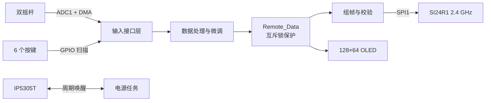

# 基于 STM32F103 的航模遥控器

这是一个面向小型飞行器的手持遥控器固件项目。系统以 STM32F103C8T6 为主控，通过双摇杆和 6 个按键采集控制量，使用 SI24R1 进行 2.4 GHz 无线发送，并在 128×64 OLED 上显示当前通道和四轴控制量。应用任务由 FreeRTOS 调度，底层外设由 STM32 HAL 驱动。

> 当前仓库是遥控器发射端固件，不包含飞行器接收端、飞控算法和上位机工程。

## 功能特性

- ADC1 扫描 4 路摇杆信号，使用 DMA 循环搬运数据
- 将油门、偏航、俯仰和滚转统一映射并限制在 `0~1000`
- 方向按键支持俯仰、滚转微调
- 功能按键支持定高、关机等瞬时指令
- SI24R1 固定 20 字节载荷发送，带 3 字节帧头和 32 位累加校验和
- OLED 显示无线信道与四轴控制量
- USART1 输出 VOFA+ FireWater 格式调试数据
- 使用 FreeRTOS 任务拆分采集、交互、显示、通信和电源管理逻辑
- 使用互斥锁保护跨任务共享的遥控数据

## 系统结构



## 硬件与外设

| 模块 | 配置 | 引脚 |
| --- | --- | --- |
| MCU | STM32F103C8T6，Cortex-M3，72 MHz，64 KB Flash，20 KB RAM | — |
| 左/右摇杆 | ADC1 四通道扫描，DMA 循环模式 | PA1 / PA6 / PA2 / PA3 |
| SI24R1 | SPI1，Mode 0，MSB First，SPI 时钟分频 8 | PB3 SCK、PB4 MISO、PB5 MOSI、PA15 CS、PB7 CE |
| OLED | 软件模拟串行接口，128×64 | PA4 CS、PB1 DC、PB0 RST、PA7 SDA、PA5 SCL |
| 按键 | 低电平有效，内部上拉 | PB2、PB10、PB11、PB12、PB13、PB14 |
| 电源管理 | 周期拉低按键脚，防止 IP5305T 自动关机 | PB15 |
| 调试串口 | USART1，115200-8-N-1 | PA9 TX、PA10 RX |
| 下载调试 | SWD | PA13 SWDIO、PA14 SWCLK |

ADC 的扫描顺序直接对应 `Joystick_Struct`：

| ADC 顺序 | 通道/引脚 | 控制量 |
| --- | --- | --- |
| Rank 1 | ADC1_IN1 / PA1 | throttle（油门） |
| Rank 2 | ADC1_IN6 / PA6 | yaw（偏航） |
| Rank 3 | ADC1_IN2 / PA2 | pitch（俯仰） |
| Rank 4 | ADC1_IN3 / PA3 | roll（滚转） |

## 按键功能

| 按键 | 引脚 | 当前功能 |
| --- | --- | --- |
| 上 | PB11 | 俯仰微调 `+10` |
| 下 | PB14 | 俯仰微调 `-10` |
| 左 | PB13 | 滚转微调 `-10` |
| 右 | PB12 | 滚转微调 `+10` |
| 左上 | PB2 | 短按发送关机指令 |
| 右上 | PB10 | 短按发送定高指令；驱动层可识别长按 |

按键使用 10 ms 延时消抖，并等待释放后再上报一次事件。定高和关机标志在取出一帧数据后自动清零，因此属于瞬时指令。

## FreeRTOS 任务

系统 Tick 频率为 1 kHz，动态堆大小为 15 KB。每个应用任务当前分配 128 words 栈空间。

| 任务 | 优先级 | 周期 | 作用 |
| --- | ---: | ---: | --- |
| `power_task` | 4 | 10 s | 触发 IP5305T 按键脚，防止电源自动关闭 |
| `com_task` | 3 | 6 ms | 生成数据帧并通过 SI24R1 发送 |
| `key_task` | 2 | 20 ms | 扫描按键并更新微调/功能标志 |
| `joystick_task` | 2 | 20 ms | 启动 ADC DMA 并处理四路摇杆数据 |
| `screen_task` | 1 | 100 ms | 刷新 OLED 显示 |

## 无线参数与数据协议

SI24R1 当前配置如下：

- 地址：`0A 01 07 0E 01`
- RF 信道：`40`
- 空中速率：2 Mbps
- 发射功率：7 dBm
- 自动应答：开启
- 自动重发：最多 10 次
- 固定载荷：20 字节

所有 16 位和 32 位数值均按大端序发送。协议有效内容为前 17 字节，剩余 3 字节保留并保持为 `0x00`。

| 偏移 | 长度 | 字段 | 说明 |
| ---: | ---: | --- | --- |
| 0 | 3 | 帧头 | ASCII `YJR`，即 `59 4A 52` |
| 3 | 2 | throttle | 油门，`0~1000` |
| 5 | 2 | yaw | 偏航，`0~1000` |
| 7 | 2 | pitch | 俯仰，`0~1000` |
| 9 | 2 | roll | 滚转，`0~1000` |
| 11 | 1 | altitude | 定高瞬时标志 |
| 12 | 1 | shutdown | 关机瞬时标志 |
| 13 | 4 | checksum | 字节 0~12 的无符号累加和 |
| 17 | 3 | reserved | 保留字节，当前为 `0x00` |

接收端必须使用相同的地址、信道、速率和 20 字节固定载荷，并按上表解析数据。

## 软件结构

```text
.
├── APP/                  # FreeRTOS 任务、数据处理、显示与无线组帧
├── Commom/               # 通用限幅和串口调试工具
├── Core/                 # STM32CubeMX 生成的启动与外设初始化代码
├── Drivers/              # CMSIS 与 STM32F1 HAL 驱动
├── FreeRTOS/             # FreeRTOS Kernel V11.1.0 及项目配置
├── Interface/            # 摇杆、按键、SI24R1、IP5305T 和 OLED 接口层
├── cmake/                # ARM GCC 工具链和 CubeMX CMake 配置
├── HAL_Remote.ioc        # STM32CubeMX 工程配置
├── STM32F103XX_FLASH.ld  # 链接脚本
└── Xmind.md              # 早期功能设计与开发笔记
```

## 构建

### 环境要求

- CMake 3.22 或更高版本
- Ninja
- GNU Arm Embedded Toolchain（`arm-none-eabi-gcc`、`arm-none-eabi-objcopy` 等命令需在 `PATH` 中）
- 可选：STM32CubeProgrammer 或 OpenOCD，用于下载和调试

### 编译 Debug 固件

```bash
cmake --preset Debug
cmake --build --preset Debug
```

Release 构建：

```bash
cmake --preset Release
cmake --build --preset Release
```

编译生成的 ELF 文件位于：

```text
build/Debug/HAL_Remote.elf
build/Release/HAL_Remote.elf
```

如需生成 HEX 或 BIN：

```bash
arm-none-eabi-objcopy -O ihex build/Debug/HAL_Remote.elf build/Debug/HAL_Remote.hex
arm-none-eabi-objcopy -O binary build/Debug/HAL_Remote.elf build/Debug/HAL_Remote.bin
```

之后可通过 SWD 和你使用的烧录工具下载固件。仓库没有绑定特定调试器配置。

## 调试输出

通信任务会通过 USART1 输出以下格式的数据，可直接由 VOFA+ 的 FireWater 协议解析：

```text
:throttle,yaw,pitch,roll,altitude,shutdown
```

例如：

```text
:500,500,500,500,0,0
```

## 当前状态与注意事项

- 当前代码仍处于开发和硬件联调阶段，建议首次使用前核对摇杆方向、中心值和行程。
- 上电校准函数目前在 ADC DMA 启动之前、FreeRTOS 调度器启动之前执行，但函数内部使用了 FreeRTOS 延时与互斥量；该流程需要调整后再用于实际校准。
- 按键驱动返回的是 `KEY_RIGHT_X_LONG`，应用层当前监听的是 `KEY_LEFT_X_LONG`，因此长按校准尚不能按预期触发。
- OLED 读取共享的 `remote_data` 时未加互斥锁；若后续继续扩展显示内容，建议先复制一份受锁保护的快照。
- `CHANNEL`、`TX_ADDRESS`、`TX_PLOAD_WIDTH` 或协议字段发生变化时，接收端必须同步修改。
- 仓库根目录暂未提供项目自有代码的许可证；`Drivers/` 与 `FreeRTOS/` 中的第三方代码遵循各自许可证。

## 后续计划

- 修正并验证摇杆上电/长按校准流程
- 增加接收端参考实现与协议解析示例
- 增加 SI24R1 发送状态、丢包率和故障提示
- 补充实物接线图、成品照片和烧录配置
- 增加自动构建与静态检查
